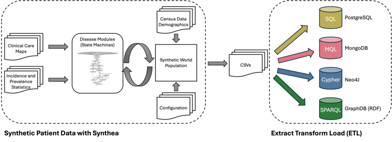

# Database Setup Instructions

SM3-Text-to-Query contains four database systems: PostgreSQL, Neo4j, Graph, and MongoDB. The following instructions will guide you through setting up each of these databases.
Use the provided `environment.yml` file to ensure the appropriate dependencies are installed.



**Note: These instructions will be heavily updated and improved during the next couple of weeks.**


## PostgreSQL

1. **Install PostgreSQL**
   - Install PostgreSQL for your system according to the instructions [here](https://www.postgresql.org/download/).
2. Run the `setup-postgres.py` script with the appropriate parameters.

--------------------------------------------------------------------------------------------------------------------------------------------------------------
# Neo4j DB Instructions

## Prerequisites
- Python 3
- Pip

## Steps to Ingest Data

1. **Clone or Download the Pyingest Project**
   - Clone or download the pyingest project from GitHub [here](https://github.com/neo4j-field/pyingest).

2. **Obtain Dependencies**
   - Run the following command to install the necessary dependencies:
     ```bash
     pip3 install -r requirements.txt
     ```

3. **Modify Configuration**
   - Modify the `config.yml` file in the setup_dbs folder to specify your Neo4j connection information and the location of the CSV files from Synthea.

4. **Run the Ingestion Script**
   - From the root folder of your pyingest checkout, run the following command:
     ```bash
     python3 src/main/ingest.py $YOURPATH/SM3-Text-to-Query/src/setup_dbs/config_neo4j.yml
     ```
   - Replace `$YOURPATH` with the path to the root of this project.
--------------------------------------------------------------------------------------------------------------------------------------------------------------
# Graph DB Instructions

1. **Syntha RDF setup**
   - Follow instruction from [synthea-rdf](https://github.com/SithursanS/synthea-rdf)
--------------------------------------------------------------------------------------------------------------------------------------------------------------
# MongoDB Instructions

1. Install MongoDB for your system according to https://www.mongodb.com/docs/manual/installation/
2. Follow the instructions in the `setup-mongodb.ipynb` notebook and execute it. 
--------------------------------------------------------------------------------------------------------------------------------------------------------------
