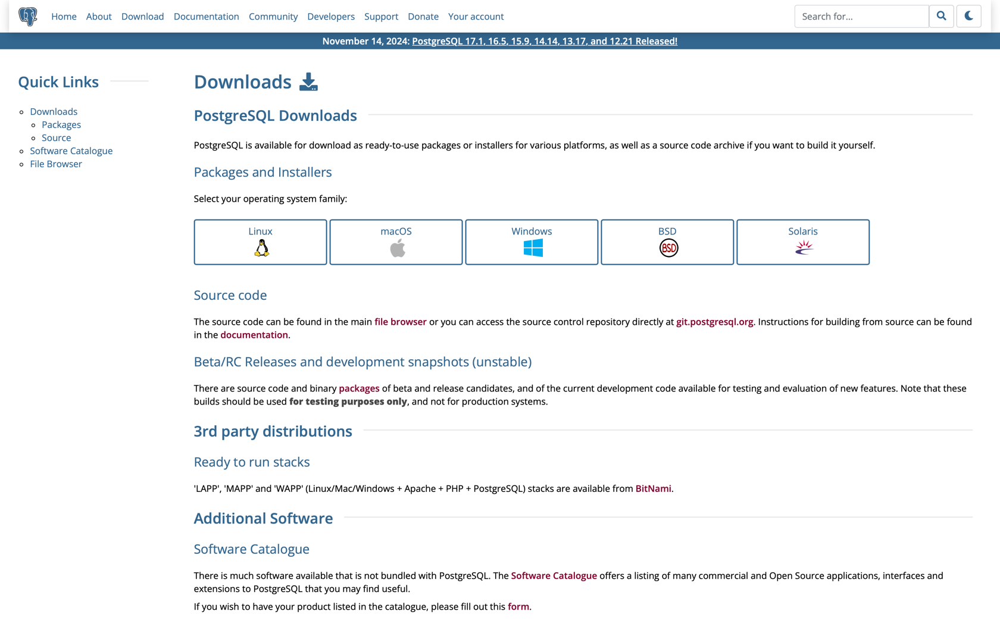
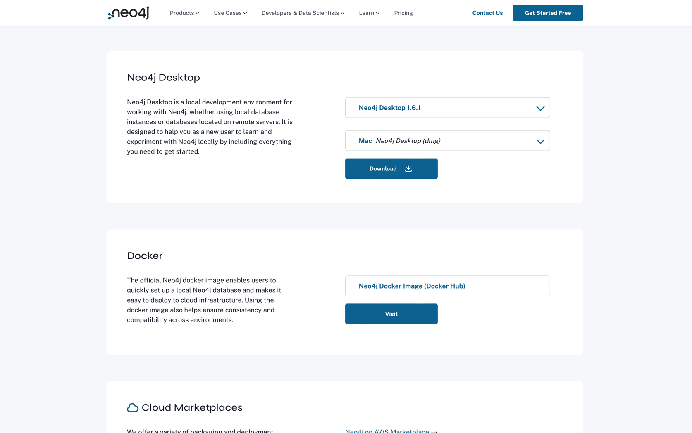

# Database Setup Instructions

SM3-Text-to-Query contains four different database systems: PostgreSQL, Neo4j, Graph, and MongoDB. The following instructions will guide you through setting up each of these databases.
Use the provided environment.yml file to make sure that the appropriate dependencies are installed.

**Note: This will be heavily updated and improved during the next couple of weeks.**

## Setting up Virtual environment with project dependencies 

1. **Install miniconda**
   - Install miniconda for your system based on the official documentation [here.](https://docs.anaconda.com/miniconda/)
2. **Creating virtual environment**
   - Run the following command to create virtual environment based on project specifications
     - For Mac: (checked works)
     
     ```conda env create -f ./src/environment.yml```
     
     ```conda activate sm3```
     - For Windows: (To verify on thinkpad) 
     
     ```conda env create -f ./src/environment.yml```
     
     ```conda activate sm3```
     - For Linux: (To verify on thinkpad)
     
     ```conda env create -f ./src/environment.yml```
     
     ```conda activate sm3```
   
--------------------------------------------------------------------------------------------------------------------------------------------------------------
# PostgreSQL DB Instructions

## Prerequisites
### Installation of PostgreSQL
Install PostgreSQL for your system according to the instructions provided [here](https://www.postgresql.org/download/).


## Steps to Ingest Synthea Data in PostgreSQL
### Ingestion with custom file:
1. Run the `setup-postgres.py` script with the appropriate parameters.

--------------------------------------------------------------------------------------------------------------------------------------------------------------
# Neo4j DB Instructions

## Prerequisites
### Installation of Neo4j Desktop
Install Neo4j Desktop for your system according to the instructions provided [here](https://neo4j.com/deployment-center/?desktop-gdb).


## Steps to Ingest Synthea Data in Neo4j
### Ingestion with custom file: 


### Ingestion with pyingest: 
1. **Clone or Download the Pyingest Project**
   - Clone or download the pyingest project from GitHub [here](https://github.com/neo4j-field/pyingest).

2. **Obtain Dependencies**
   - Run the following command to install the necessary dependencies:
     ```bash
     pip3 install -r requirements.txt
     ```

3. **Modify Configuration**
   - Modify the `config.yml` file in the setup_dbs folder to specify your Neo4j connection information and the location of the CSV files from Synthea.

4. **Run the Ingestion Script**
   - From the root folder of your pyingest checkout, run the following command:
     ```bash
     python3 src/main/ingest.py $YOURPATH/SM3-Text-to-Query/src/setup_dbs/config_neo4j.yml
     ```
   - Replace `$YOURPATH` with the path to the root of this project.
--------------------------------------------------------------------------------------------------------------------------------------------------------------
# Graph DB Instructions

## Prerequisites
### Installation of GraphDB

### Steps to Ingest Synthea Data in GraphDB 

1. **Syntha RDF setup**
   - Follow instruction from [synthea-rdf](https://github.com/SithursanS/synthea-rdf)
--------------------------------------------------------------------------------------------------------------------------------------------------------------
# MongoDB Instructions

## Prerequisites
### Installation of MongoDB
1. Install MongoDB for your system according to https://www.mongodb.com/docs/manual/installation/

### Steps to Ingest Synthea Data in MongoDB
2. Follow the instructions in the `setup-mongodb.ipynb` notebook and execute it. 
--------------------------------------------------------------------------------------------------------------------------------------------------------------
