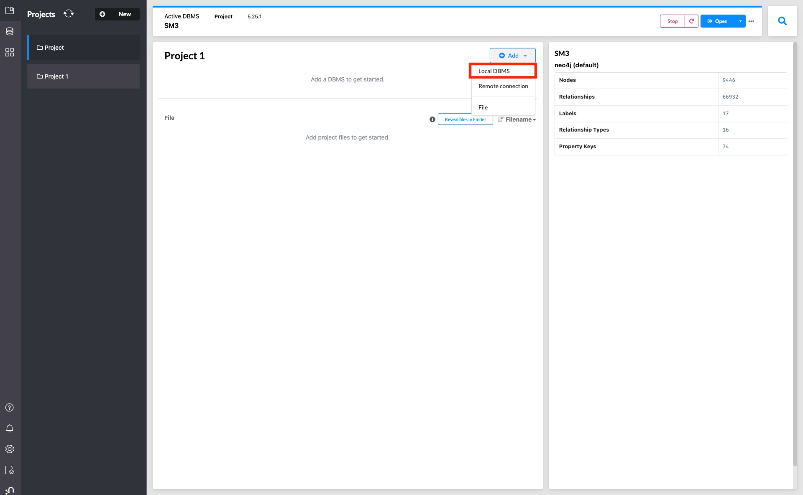
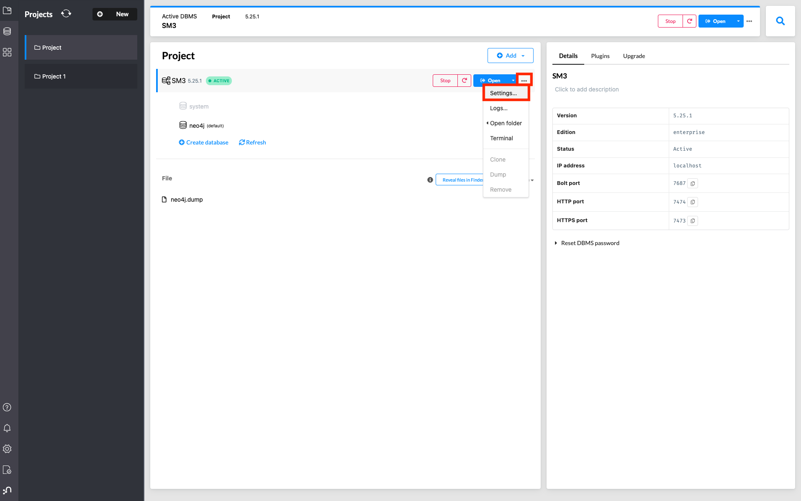
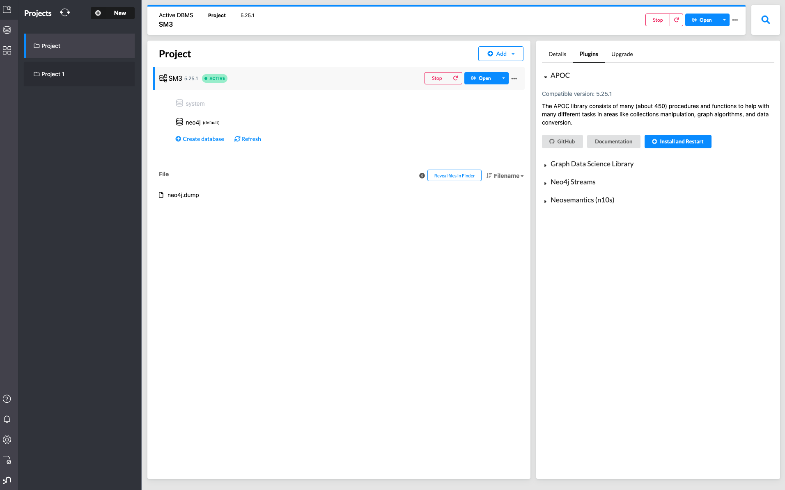

# Database Setup Instructions

SM3-Text-to-Query contains four different database systems: PostgreSQL, Neo4j, Graph, and MongoDB. The following instructions will guide you through setting up each of these databases.
Use the provided environment.yml file to make sure that the appropriate dependencies are installed.

**Note: This will be heavily updated and improved during the next couple of weeks.**

## Setting up Virtual environment with project dependencies 

1. **Install miniconda**
   - Install miniconda for your system based on the official documentation [here.](https://docs.anaconda.com/miniconda/)
2. **Creating virtual environment**
   - Run the following command to create virtual environment based on project specifications
     - For Mac: (checked works)
     
     ```conda env create -f ./src/environment.yml```
     
     ```conda activate sm3```
     - For Windows: (To verify on thinkpad) 
     
     ```conda env create -f ./src/environment.yml```
     
     ```conda activate sm3```
     - For Linux: (To verify on thinkpad)
     
     ```conda env create -f ./src/environment.yml```
     
     ```conda activate sm3```
   
--------------------------------------------------------------------------------------------------------------------------------------------------------------
# PostgreSQL DB Instructions

## Prerequisites
### Installation of PostgreSQL
Install PostgreSQL for your system according to the instructions provided [here](https://www.postgresql.org/download/).


## Steps to Ingest Synthea Data in PostgreSQL
### Ingestion with custom file:
1. Run the `./postgres/setup-postgres.py` script with the appropriate parameters.

--------------------------------------------------------------------------------------------------------------------------------------------------------------
# Neo4j DB Instructions

## Prerequisites
### Installation of Neo4j Desktop
1. Install Neo4j Desktop for your system according to the instructions provided [here](https://neo4j.com/deployment-center/?desktop-gdb).


2. Open Neo4j Desktop Create a new Project.
3. Add Local DBMS system to project

4. Create DBMS system 
- Name:SM3 
- Password: password
5. Update Settings File
- Add the following lines: to the settings file: 

server.memory.heap.initial_size=1G

server.memory.heap.max_size=4G

server.memory.pagecache.size=2G

dbms.memory.transaction.total.max=5G

- Press Apply and then close settings


6. Install APOC plugin
- Change to the Plugin Tab of the database
- Install and Restart the Neo4j database with the button "Install and Restart"


## Steps to Ingest Synthea Data in Neo4j
### Ingestion with custom file: 
1. Run the `./neo4j/ingest.py` script with the appropriate parameters.


--------------------------------------------------------------------------------------------------------------------------------------------------------------
# Graph DB Instructions

## Prerequisites
### Installation of GraphDB
1. Install GraphDB Desktop for your system according to the instructions provided [here](https://graphdb.ontotext.com/documentation/10.7/graphdb-desktop-installation.html)

### Steps to Ingest Synthea Data in GraphDB 

1. **Syntha RDF setup**
   - Follow instruction from [synthea-rdf](https://github.com/SithursanS/synthea-rdf)
--------------------------------------------------------------------------------------------------------------------------------------------------------------
# MongoDB Instructions

## Prerequisites
### Installation of MongoDB
1. Install MongoDB for your system according to https://www.mongodb.com/docs/manual/installation/

### Steps to Ingest Synthea Data in MongoDB
2. Follow the instructions in the `setup-mongodb.ipynb` notebook and execute it. 
--------------------------------------------------------------------------------------------------------------------------------------------------------------
